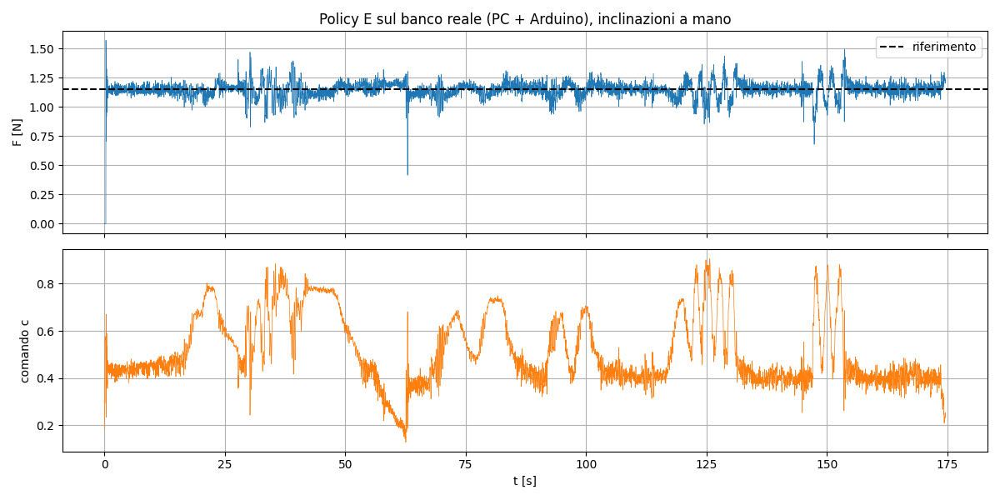

# FAN SAC Controller

Controllo in forza di un fan (motore brushless + ESC) con **Reinforcement Learning (SAC)**,
addestrato in simulazione e trasferito su un banco prova reale.

Progetto didattico: lo scopo è capire come funziona il RL "dall'inizio alla fine", quindi il
controllo è **RL puro**, senza PID, nemmeno ibrido.



## Il problema

Un carrellino su una corsia inclinabile spinge, tramite il fan, contro una **load cell**.
La cella misura

$$F_{lc} = T - m\,g\,\sin\theta + \text{bias} + \text{rumore}$$

L'obiettivo è tenere $F_{lc} = 1.15$ N mentre l'inclinazione $\theta$ della corsia cambia
(entro ±14°). La rete **non vede** l'inclinazione: deve dedurla dall'effetto sulla forza.

## Pipeline

```
banco reale ──[test]──▶ dati ──[system identification]──▶ parametri del modello
                                                                  │
                                                                  ▼
          policy SAC (rete neurale) ◀──[training]── simulatore (env_fan.py)
                  │
                  ▼
     test sul banco reale (PC + Arduino)  ──▶  deploy su STM32 (la rete gira sul chip)
```

## Risultati principali

| | Simulatore | Banco reale |
|---|---|---|
| RMS errore di forza, policy E | 0.078–0.090 N | **0.067–0.085 N** |
| Errore medio, policy E | — | +0.003 N |
| RMS errore, policy F, ritardo 3 passi (come il banco PC + Arduino) | 0.111 N (E: 0.151 N) | — |
| RMS errore, policy F **sullo STM32**, ESC a 16 V | 0.096 N (ritardo 1 passo) | **0.096 N** |
| RMS errore, policy F sullo STM32, ESC a 12 V | — | 0.148 N |

Il trasferimento simulatore → banco ha funzionato: le prestazioni reali stanno nell'intervallo
previsto dalla simulazione. Sul banco la policy E mostrava un'oscillazione a ~3 Hz, dovuta al
ritardo dell'anello PC + Arduino (~60 ms). La policy F, addestrata con ritardi fino a 80 ms e
con la storia dei comandi nell'osservazione, in simulazione riduce quell'oscillazione di circa
tre volte (vedi [docs/04](docs/04_ambiente_e_training.md)).

**Stato:** sysid ✅ · simulatore validato ✅ · policy E sul banco ✅ · policy F in simulazione ✅ ·
policy F sul banco ✅ · **deploy su STM32 ✅** ([docs/07](docs/07_deploy_stm32.md), report [docs/08](docs/08_prove_stm32.md))

## Dove si lavora

Questa cartella (`J:\PYTHON\RL\fan-sac-controller`) è **l'unica copia viva** del progetto.

- Il firmware STM32 si apre, si compila e si carica **da qui**: `stm32/firmware/FanStm32`
  (in STM32CubeIDE: *File → Import → Existing Projects into Workspace*). Il file da caricare
  con STM32CubeProgrammer è `stm32/firmware/FanStm32/Debug/FanStm32.elf`.
- Le copie vecchie del progetto sono archiviate in `J:\PYTHON\RL\_archivio` (e
  `J:\PYTHON\STM32\PROJECT\FanStm32`): non vanno più modificate.

## Struttura

| Cartella | Contenuto |
|---|---|
| `firmware/` | sketch Arduino: ponte PC ↔ ESC + HX711 |
| `stm32/` | deploy su STM32F407: `rete/` (rete in C, esportazione, verifica dei pesi), `firmware/FanStm32/` (progetto CubeIDE), `monitor_stm32.py` (prova dal PC), `analizza_prova.py` (metriche e grafici) |
| `sysid/` | acquisizione dati e analisi per la system identification |
| `controller/` | ambiente Gymnasium, training, valutazione, controllo sul banco reale |
| `data/` | dati grezzi: test sysid e prove reali |
| `models/` | policy addestrate |
| `docs/` | manuali |

## Manuali

1. [Banco e hardware](docs/01_banco_hardware.md): componenti, cablaggio, modifiche, calibrazione
2. [Firmware e protocollo](docs/02_firmware_e_protocollo.md): come PC e Arduino si parlano
3. [System identification](docs/03_system_identification.md): dai dati al modello del banco
4. [Ambiente e training](docs/04_ambiente_e_training.md): osservazioni, azioni, reward, esperimenti A–F
5. [Prove sul banco reale](docs/05_prove_sul_banco.md): come lanciare una prova in sicurezza
6. [Lezioni imparate](docs/06_lezioni_imparate.md): problemi incontrati, diagnosi e soluzioni
7. [Deploy su STM32](docs/07_deploy_stm32.md): rete in C, clock, USB, firmware di controllo, collegamenti
8. [Report prove STM32](docs/08_prove_stm32.md): la policy F sul chip, 12 V contro 16 V, cambio di riferimento
9. **[Manuale completo](docs/09_manuale_completo.md)**: teoria + pratica + tutorial per rifare l'esperimento a casa

Appunti in PDF:
- [Modello fisico e training SAC](docs/appunti/appunti_modello_training_sac.pdf): modello del banco derivato da zero, formulazione RL, teoria del SAC, esperimenti A-F
- [Deploy della policy su STM32F407](docs/appunti/appunti_deploy_stm32.pdf): appunti di ingegneria completi, con tutto il codice C commentato
- [La schermata Clock Configuration](docs/Clock_Configuration_STM32F407.pdf): come si calcolano M, N, P, Q e i prescaler

## Avvio rapido

```bash
pip install -r requirements.txt
cd controller
python env_fan.py          # training (300k step, ~1.5 h su CPU)
python valuta.py           # valutazione in simulazione del modello migliore
python controllo_reale.py  # prova sul banco (Arduino con firmware/banco_sysid_v2)

cd ../stm32
python monitor_stm32.py COM4                 # prova con la rete sullo STM32 (firmware/FanStm32)
python analizza_prova.py ../data/prove_reali/F_stm32_16V.csv   # metriche e grafico
```

Autore: Matteo Faggian
