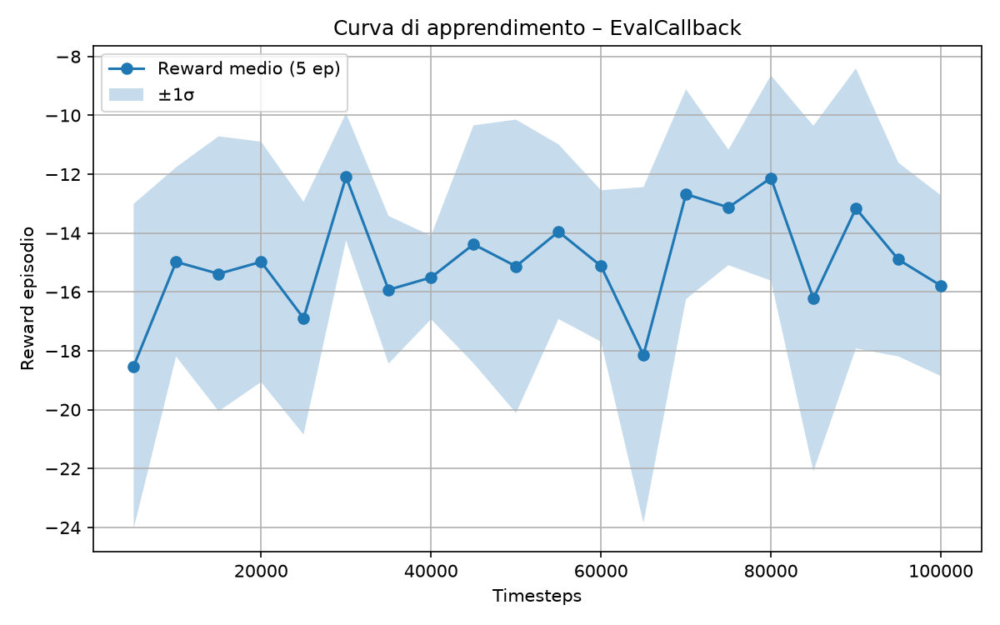

# fan-sac-controller

Thrust control of an electric fan using **Soft Actor-Critic (SAC)**, with a physical test bench (ESC + 1 kg load cell read by HX711 + STM32F407) on a tilting platform.

> 🚧 **Work in progress** — the simulation environment is in place; the from-scratch PyTorch SAC agent and the hardware-in-the-loop link to the STM32 are under development.

## How it works

The load cell measures

$$F_{lc} = T - m g \sin\theta + \text{bias} + \text{noise}$$

where $T$ is the fan thrust, modelled with first-order rotor dynamics (time constant $\tau$).

**Observation** (normalized): load-cell force, tracking error, force derivative, last ESC command, integral of the error.
**Action:** $a \in [-1, 1] \;\rightarrow\; \text{ESC} = (a+1)/2 \in [0, 1]$.

## Learning curve

## Repository structure

| File | Content |
|---|---|
| `env_fan.py` | Gymnasium environment of the fan + load cell + tilting platform |
| `sac_agent.py`, `networks.py`, `replay_buffer.py` | SAC agent implemented from scratch in PyTorch *(WIP)* |
| `train.py`, `test.py`, `config.py` | Training / evaluation scripts and hyperparameters *(WIP)* |
| `sac_fan.zip`, `best_sac_fan/best_model.zip` | Trained model checkpoints |
| `logs/` | Evaluation logs |
| `ARDUINO/esc_manual_control/` | Arduino sketch: ESC calibration + manual throttle via serial (0–180) — tested on hardware |

## Hardware

- Electric fan driven by an ESC
- 1 kg load cell + HX711 amplifier
- STM32F407VET6 board
- Tilting platform (angle $\theta$)

## Author

Matteo Faggian — MSc Aerospace Engineering (Space), University of Padova
