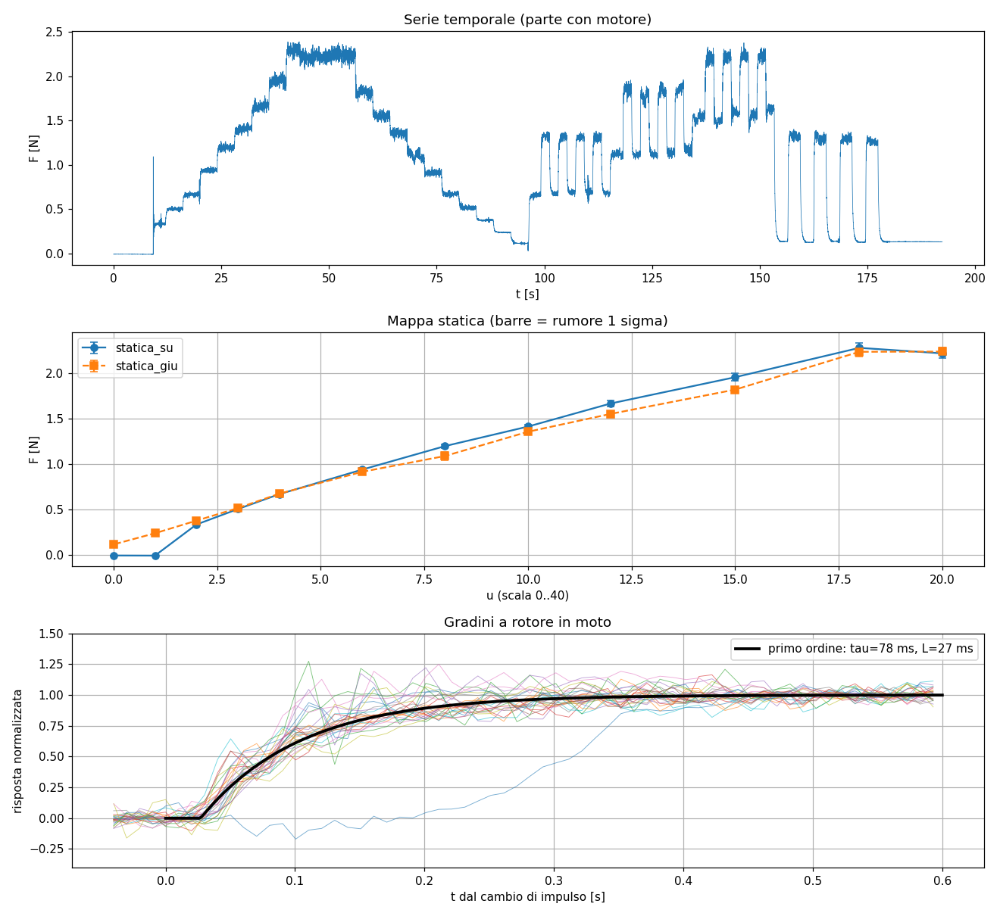
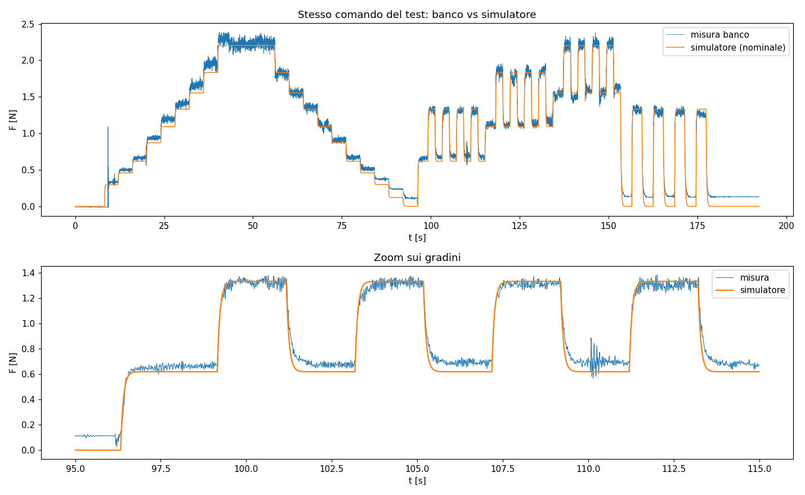

# 3. System identification

## Perché serve

La policy SAC impara **solo nel simulatore**: non vede mai il banco durante il training.
Se il simulatore è diverso dalla realtà, la policy impara una strategia ottima per un sistema
che non esiste (*sim-to-real gap*). La system identification misura il banco vero e ricava i
parametri del modello del simulatore.

Non è machine learning: è stima di parametri classica, con un modello fisico scelto da noi e
un fit ai minimi quadrati.

## 1. Acquisizione: `sysid/sysid_acquisizione_v2.py`

Con il firmware `banco_sysid_v2.ino` sull'Arduino:

```bash
cd sysid
python sysid_acquisizione_v2.py
```

Fasi (~4 minuti):

| Fase | Comando | Cosa misura |
|---|---|---|
| `cal_zero` | motore fermo, cella scarica | offset; verifica che l'HX711 vada a ~100 Hz |
| `cal_peso` | motore fermo, 317 g sulla cella | fattore di scala conteggi → N |
| `rumore_fermo` | 30 s fermo | rumore elettrico |
| `statica_su` / `statica_giu` | scalini da 4 s, 0 → 20 → 0 | mappa statica, deadband, isteresi |
| `gradino` | salti tra due livelli, ×4 | costante di tempo e ritardo col rotore in moto |
| `partenza` | da fermo a u = 10, ×4 | ritardo di avvio |
| `zero_fine` | 15 s fermo | spostamento dello zero dopo i test |

## 2. Analisi: `sysid/analisi_sysid.py`

```bash
python analisi_sysid.py      # legge data/sysid/sysid_dati_v2.csv
```

Produce `sysid_params.json` (da copiare in `controller/`) e `analisi_sysid.png`.

Passi:

1. **Calibrazione** con la retta a due punti.
2. **Rumore** con la MAD (mediana degli scarti assoluti × 1.4826): una stima della deviazione
   standard insensibile a pochi campioni anomali.
3. **Mappa statica**: per ogni scalino scarta 1.5 s di transitorio e prende la mediana.
4. **Dinamica**: per ogni gradino, fit ai minimi quadrati di un primo ordine con ritardo puro:

$$F(t) = \begin{cases} F_0 & t < L \\ F_0 + (F_1 - F_0)\left(1 - e^{-(t-L)/\tau}\right) & t \ge L\end{cases}$$

   I gradini sono allineati all'istante in cui l'Arduino ha cambiato l'impulso (colonna
   `u_us`), non a quando il PC ha cambiato fase: così $L$ misura solo il ritardo fisico.
5. **Tabella "in moto"** e soglie di avvio/arresto, per modellare l'isteresi della deadband.



## Risultati

| Parametro | Valore |
|---|---|
| Mappa comando → spinta | quasi lineare, ~0.11 N per unità di u |
| Spinta massima | 2.2–2.28 N (limitata dall'alimentatore) |
| Avvio / arresto del motore | u > 1.5 / u < 0.5 (isteresi) |
| τ col rotore in moto | 78 ms (33–112 ms) |
| τ in spegnimento | 174 ms (il rotore rallenta per inerzia) |
| Ritardo col rotore in moto | 27 ms |
| Ritardo di avvio da fermo | 200 ms |
| Rumore | 1 mN + 2.1% della spinta |
| Spostamento dello zero dopo i test | +0.13 N |
| Frequenza HX711 | ~99.6 Hz |

## Validazione del simulatore

Stessa sequenza di comandi del test, data al simulatore e confrontata con la misura:
errore RMS ~0.07 N, dovuto soprattutto allo spostamento dello zero (coperto in training dalla
randomizzazione del bias).



## Quando rifarla

Ogni volta che cambia l'hardware: elica, ESC, limite di corrente dell'alimentatore,
calibrazione. Si rifà il test, si rilancia l'analisi, si copia il nuovo `sysid_params.json`
in `controller/` e si riaddestra. Il codice non si tocca.
