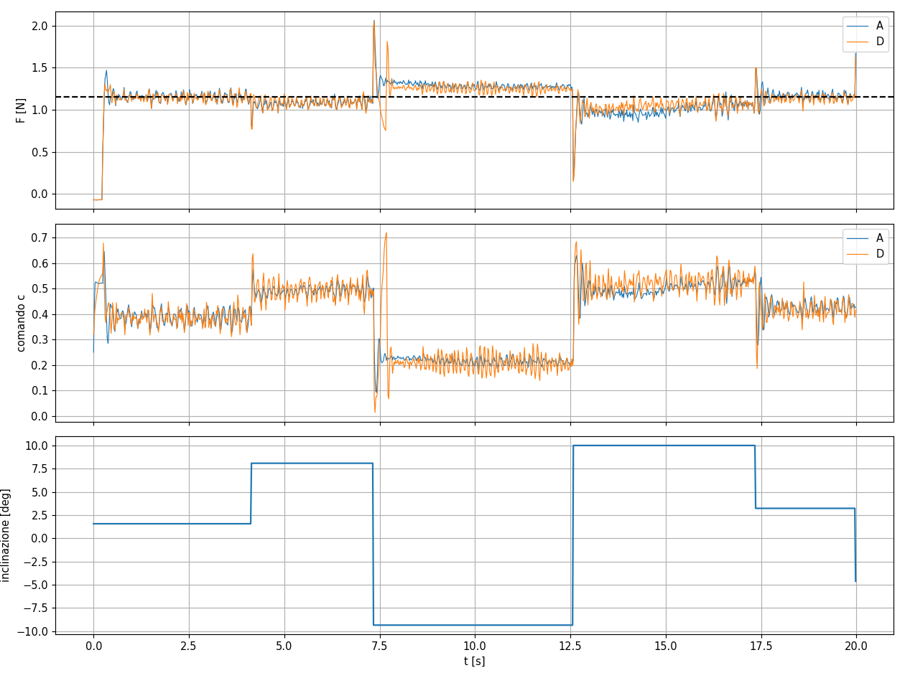
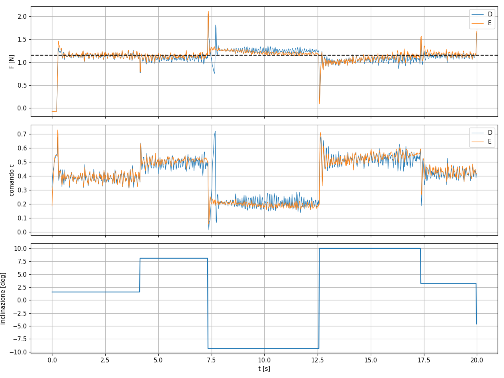
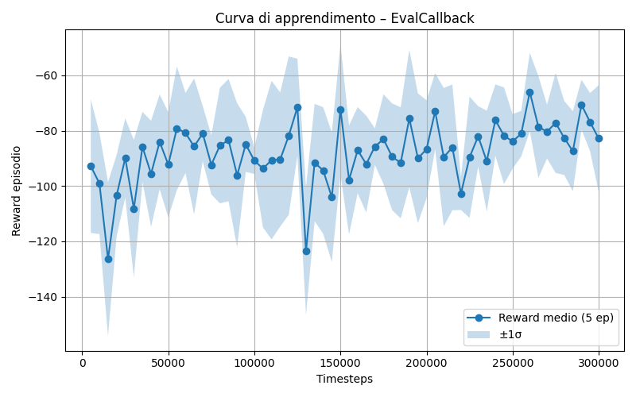
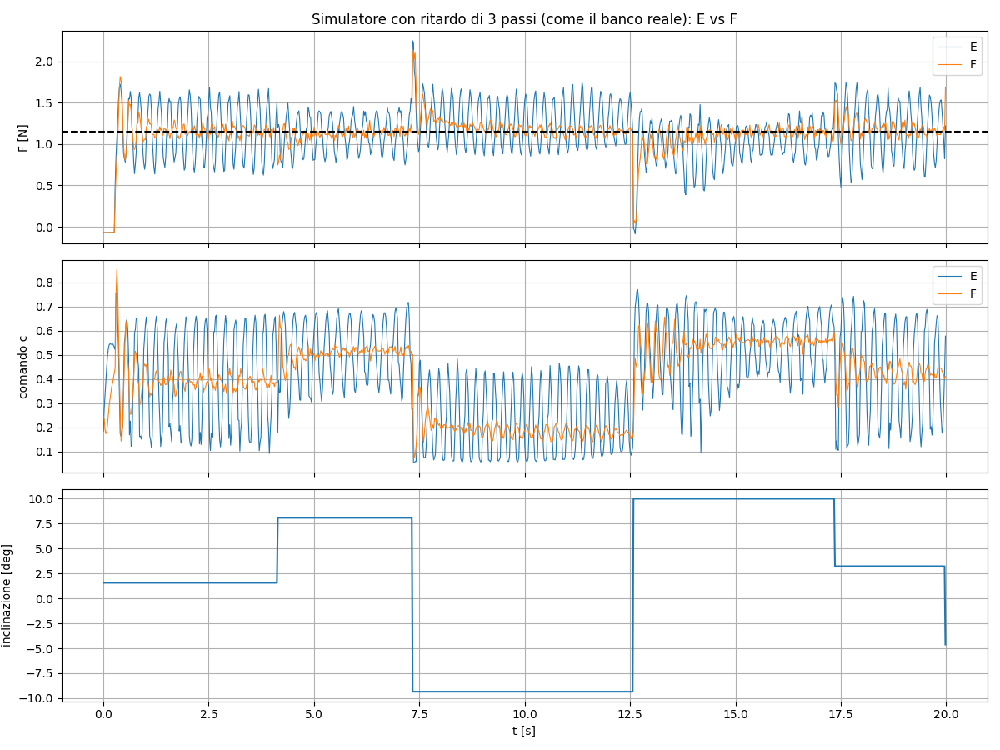

# 4. Ambiente e training

> Versione estesa con le derivazioni (modello del rotore, discretizzazione esatta, teoria del SAC) e il codice commentato: [appunti in PDF](appunti/appunti_modello_training_sac.pdf).

File: `controller/env_fan.py` (ambiente Gymnasium + training SAC con Stable-Baselines3).

## Il ciclo del RL in questo progetto

A ogni passo (20 ms, 50 Hz):

1. l'ambiente dà un'**osservazione** alla rete;
2. la rete sceglie un'**azione**, cioè il comando al fan;
3. il simulatore avanza di un passo e calcola il **reward**.

SAC (Soft Actor-Critic) impara una policy che massimizza la somma scontata dei reward futuri,
aggiungendo un bonus di entropia che la spinge a esplorare.

## Osservazioni (versione F, 7 valori)

| # | Osservazione | Normalizzazione |
|---|---|---|
| 0 | forza misurata | / 2.5 N |
| 1 | errore = riferimento − forza | / 1.15 N |
| 2 | derivata della forza, filtrata (EMA, β = 0.2) | / 2.5 N |
| 3–5 | ultimi 3 comandi | già in [0, 1] |
| 6 | integrale dell'errore (saturato) | / 0.5 N·s |

L'inclinazione **non** è osservata: è il disturbo da compensare.

## Azione

$a \in [-1, 1]$ → $c = c_{min} + (1 - c_{min})\,\frac{a+1}{2}$ con $c_{min} = 0.05$
→ $u = 20\,c$ nella scala del banco.

$c_{min}$ tiene $u \ge 1$, sopra la soglia di arresto: la rete non può spegnere il motore
(una ripartenza costa 200 ms).

## Reward

$$r = -e_n^2 - w_{e1}\,|e_n| - w_{du}\,\Delta c^2 - w_u\,c^2, \qquad e_n = \frac{e}{F_{ref}}$$

con $w_{e1} = 1$, $w_{du} = 5$, $w_u = 0.01$.

- $e_n^2$ punisce molto gli errori grandi, ma è quasi piatto vicino a zero;
- $|e_n|$ ha derivata costante e spinge ad annullare anche gli errori piccoli e persistenti;
- $\Delta c^2$ penalizza un comando nervoso.

## Modello fisico e domain randomization

Il simulatore usa i parametri della system identification (`sysid_params.json`). In ogni
episodio di training i parametri sono estratti attorno ai valori misurati:

| Parametro | Intervallo |
|---|---|
| Guadagno di spinta | ×0.85 – 1.15 |
| τ in moto | ~40 – 112 ms |
| τ in spegnimento | ±15% |
| Soglie avvio/arresto | ±20–60% |
| Ritardo di avvio | ±25% |
| **Ritardo di attuazione** | **1–4 passi (20–80 ms)** |
| Rumore proporzionale | ×0.7 – 1.5 |
| Bias (zero) | −0.05 … +0.18 N |
| Massa | ±5% |
| Inclinazione | ±14°, a gradino o a rampa ogni 2–6 s |

## Iperparametri SAC

`learning_rate = 3e-4`, `buffer_size = 200k`, `batch_size = 256`, `gamma = 0.99`,
300k step, rete di default (2 × 256 neuroni, ~68k parametri nell'actor).

## Diario degli esperimenti

Valutazione su 20 episodi randomizzati, sempre con gli stessi seed. Il reward **non** è
confrontabile tra esperimenti con reward diversi: si confrontano metriche fisiche.

| Esp. | Modifica | RMS | Offset lento | Note |
|---|---|---|---|---|
| A | modello del banco dalla sysid | 0.136 N | 0.106 N | errore costante dopo ogni cambio di inclinazione |
| D | + termine $\|e_n\|$, γ 0.98 → 0.99, 300k step | 0.117 N | 0.085 N | comando più nervoso, spegnimenti del motore |
| E | + `i_max` 2.0 → 0.5, `c_min` = 0.05 | **0.090 N** | **0.049 N** | nessuno spegnimento; **testato sul banco** |
| F | + ritardo 1–4 passi, ultimi 3 comandi osservati | 0.096–0.118 N* | 0.049–0.052 N* | robusta al ritardo; miglior modello a 110k step |

\* Per F l'intervallo copre i ritardi da 1 a 4 passi: vedi la tabella sotto.





### Esperimento F: robustezza al ritardo

Stessi parametri randomizzati, ritardo di attuazione **forzato** a 1, 2, 3 e 4 passi
(12 episodi per caso). "Quota a ~3 Hz" = frazione della varianza dell'errore tra 2 e 5 Hz,
cioè quanto pesa l'oscillazione dell'anello.

| Ritardo | E: RMS | F: RMS | E: quota a ~3 Hz | F: quota a ~3 Hz | E: mean\|Δc\| | F: mean\|Δc\| |
|---|---|---|---|---|---|---|
| 1 passo (20 ms) | **0.089 N** | 0.096 N | 11% | 8% | 0.016 | 0.013 |
| 2 passi (40 ms) | **0.101 N** | 0.105 N | 20% | 12% | 0.020 | 0.014 |
| **3 passi (60 ms, banco reale)** | 0.151 N | **0.111 N** | 56% | **20%** | 0.032 | **0.014** |
| 4 passi (80 ms) | 0.237 N | **0.118 N** | 76% | **26%** | 0.045 | **0.014** |

- Con il ritardo del banco, F ha il 26% di errore in meno e circa un terzo dell'oscillazione.
- A 4 passi E è vicina all'instabilità; F peggiora di poco: è **robusta** al ritardo.
- Il comando di F resta calmo (mean|Δc| ≈ 0.014) qualunque sia il ritardo: vedendo gli ultimi
  comandi, "sa" che una correzione è già in viaggio.
- Prezzo: con ritardo piccolo F è un po' peggiore di E. È il compromesso
  **robustezza ↔ prestazioni**: una policy addestrata su un intervallo ampio di condizioni è
  più prudente nel caso facile.



### Cosa hanno insegnato

- **A → D, reward shaping.** Con solo $e^2$ un errore costante di 0.15 N costa 0.017 per
  passo, troppo poco perché la policy si sforzi di eliminarlo. Il termine lineare lo rende 8
  volte più costoso. Prezzo: comando più nervoso, perché muoverlo diventa relativamente più
  economico.
- **D → E, scala delle osservazioni.** Con `i_max = 2`, un errore di 0.1 N spostava
  l'osservazione dell'integrale di 0.05 al secondo: un segnale troppo debole per la rete. Con
  `i_max = 0.5` l'offset si è dimezzato **senza cambiare né rete né reward**.
- **E → F, ritardo e proprietà di Markov.** Sul banco la policy E oscillava a ~3 Hz. In
  simulazione si riproduce lo stesso spettro con un ritardo di 3 passi, e a 4 passi la policy
  E diventa instabile. Con un ritardo, i comandi già inviati ma non ancora arrivati fanno parte
  dello stato del sistema: se la rete non li vede, non sa che una correzione è già in viaggio
  e ne aggiunge un'altra. Da qui la storia dei comandi nell'osservazione.

## Comandi

```bash
cd controller
python env_fan.py        # training: salva best_sac_fan/best_model.zip e logs/
python valuta.py         # metriche + grafici del modello migliore
python valuta.py ../models/sac_F.zip   # il modello F (ambiente attuale)
```

Prima di un nuovo training rinomina `best_sac_fan/` e `logs/` del precedente.
