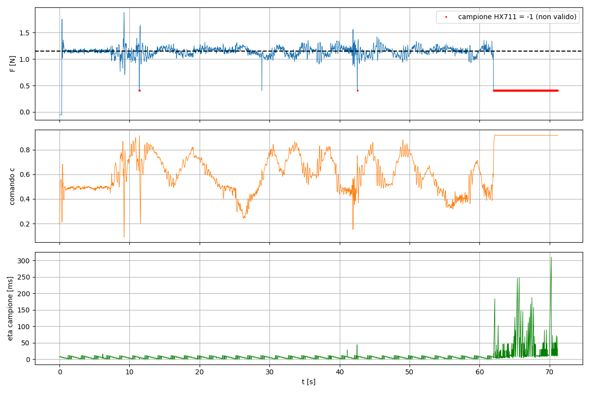

# 6. Lezioni imparate

Problemi incontrati in ordine cronologico, con sintomo, diagnosi e soluzione.

## Scelta del microcontrollore
**Problema:** l'actor SAC di default (~68k parametri, ~270 KB in float32) non sta sullo STM32
BluePill (64 KB di flash, Cortex-M3 senza FPU).
**Soluzione:** STM32F407 (512 KB di flash, Cortex-M4F con FPU): ~1 ms per inferenza, senza
quantizzazione. Le schede **G0/L0/F0** (Cortex-M0+) non hanno FPU: da evitare per reti in float.

## HX711 a 10 Hz
**Sintomo:** lo script di acquisizione segnalava ~10 Hz. Il primo valore misurato (32 Hz) era
falsato da righe vecchie accumulate nel buffer seriale durante l'attesa dell'utente.
**Soluzione:** pin RATE a VCC. Nello script: svuotare il buffer dopo le attese e calcolare la
frequenza dai timestamp dell'Arduino, non dal tempo del PC.

## Il motore non girava
**Sintomo:** l'ESC si armava ma il motore restava fermo a ogni comando.
**Diagnosi:** l'ESC è **bidirezionale** (neutro a metà corsa); il software mandava impulsi da
1000 a 1400 µs, cioè nella zona della retromarcia.
**Soluzione:** mappatura neutro 1472 µs → piena potenza 544 µs. Una procedura di calibrazione
per ESC unidirezionali avrebbe potuto tarare male i fine corsa: va verificato prima il tipo di ESC.

## Buchi di spinta e colpi a piena potenza
**Sintomo:** ogni ~2 s la spinta crollava per una frazione di secondo.
**Diagnosi:** la colonna `u_us` (impulso effettivamente applicato) mostrava per ~50 ms valori
di stop (1472 µs) o di **piena potenza** (544 µs). La libreria HX711 disabilitava gli interrupt
e la UART perdeva caratteri dei comandi.
**Soluzione:** lettura HX711 senza bloccare gli interrupt, comando a formato fisso con cifra di
controllo, contatore dei comandi scartati. Risultato: 1 comando scartato in tutto il test
successivo.
**Lezione:** registrare sempre ciò che l'attuatore ha *ricevuto*, non solo ciò che si è chiesto.

## Spinta limitata dall'alimentatore
**Sintomo:** sopra u ≈ 18 la spinta si appiattisce a ~2.25 N, e oltre u ≈ 25 il motore si ferma.
**Scelta:** invece di alzare il limite di corrente, compito ridimensionato: inclinazione ±14° e
riferimento 1.15 N, dimensionati imponendo che la spinta richiesta $F_{ref} + m g \sin\theta$
resti nella zona utile [0.4, 1.9] N.

## Zero che si sposta
**Sintomo:** dopo che il motore ha girato, a motore fermo la cella legge ~+0.13 N.
**Ipotesi:** attrito o isteresi meccanica della piattaforma.
**Gestione:** zero misurato all'inizio di ogni prova e bias randomizzato in training.

## `PermissionError` caricando il modello
**Causa:** `SAC.load("best_model")` senza estensione, e una **cartella** `best_model` (uno zip
estratto) nella stessa posizione.
**Soluzione:** usare sempre `SAC.load("best_model.zip")`.

## Policy a manetta sul banco
**Sintomo:** dopo 60 s di controllo regolare, il comando sale al massimo e resta lì.
**Diagnosi:** l'HX711 ha cominciato a restituire sempre `raw = -1` (linea DT sempre alta:
chip non alimentato o filo staccato), con campioni a intervalli irregolari. La forza "vista"
era costante a 0.40 N, quindi la policy ha alzato il comando senza mai vedere un effetto:
anello aperto. Già prima c'erano stati due brevi episodi di `-1`, segno di un contatto
intermittente.
**Soluzione:** fili fissati; nello script scarto dei campioni non validi e stop se per 100 ms non
arriva un campione valido.

## Oscillazione a 3 Hz sul banco
**Sintomo:** la policy E controlla bene (RMS 0.067–0.092 N) ma oscilla visibilmente.
**Diagnosi:** la FFT dell'errore mostra un picco a ~3 Hz, presente anche nel comando: è
l'anello di controllo. In simulazione la policy E riproduce lo stesso spettro con un ritardo
di 3 passi (ne aveva visti solo 1–2 in training) e diventa instabile a 4.
**Soluzione:** esperimento F (ritardo randomizzato 1–4 passi, storia dei comandi
nell'osservazione). In simulazione con ritardo 3: errore −26%, oscillazione circa ÷3,
e nessun degrado serio fino a 4 passi.
**Lezioni:**
- la randomizzazione deve **contenere la realtà con margine**: E era stata addestrata con
  ritardi di 1–2 passi, il banco ne ha ~3;
- con un ritardo, l'osservazione deve includere i comandi "in viaggio", altrimenti lo stato
  non è più markoviano e la policy sovracorregge;
- la robustezza si paga un po' nel caso nominale: F è leggermente peggiore di E con
  ritardo di 1 passo.

## Dove finiscono i file del training
**Sintomo:** dopo il training, `best_sac_fan/` non era dove ci si aspettava.
**Causa:** i percorsi nel codice sono relativi (`./best_sac_fan`): i file finiscono nella
cartella **da cui si lancia** il comando, non in quella dello script.
**Abitudine:** lanciare sempre da `controller/` e rinominare `best_sac_fan/` e `logs/` prima
di un nuovo training, altrimenti il modello precedente viene sovrascritto.

## STM32: nessuna porta COM
**Sintomo:** dopo il caricamento, Windows non mostra nessuna COM nuova.
**Causa:** la scheda era ancora in modalità DFU: STM32CubeProgrammer vedeva VID 0x0483 / PID 0xDF11,
cioè il bootloader di fabbrica. In DFU il programma in flash non parte.
**Soluzione:** BT0 su GND e scollegare/ricollegare la USB. Il programma si presenta come
"Dispositivo seriale USB (COMx)" con PID 0x5740.

## STM32: "dispositivo USB sconosciuto" con il LED che lampeggia
**Sintomo:** LED vivo, ma Windows segnala "richiesta descrittore dispositivo non riuscita".
**Causa:** nella flash c'era **un altro programma**. Il `.elf` era stato aperto in una scheda di
CubeProgrammer ma mai scritto.
**Diagnosi:** confronto della tabella dei vettori. All'indirizzo 0x08000004 c'è l'indirizzo del
`Reset_Handler`, diverso per ogni compilazione: 0x0800071D nella flash, 0x08000BA9 nel file.
**Abitudine:** dopo Start Programming aspettare *Download verified successfully*.

## STM32: inferenza da 18 ms
**Sintomo:** la rete occupava il 92% del passo da 20 ms.
**Causa:** la configurazione Debug compila con `-O0` (ottimizzazione spenta): 46 cicli per
moltiplicazione-somma.
**Soluzione:** `-O2` → 4.18 ms. Va impostato nel progetto da cui si compila davvero:
c'erano due copie del progetto e la prima volta era stato cambiato in quella sbagliata.

## STM32: HX711 sempre a zero
**Sintomo:** `raw = 0` a ogni lettura, sempre "fresco".
**Causa:** il filo SCK non era su PB12. Senza impulsi l'HX711 tiene DT basso ("dato pronto") per
sempre e i 24 bit letti sono tutti 0.
**Indizio utile:** una cella vera non dà mai lo stesso valore due volte di fila: il rumore cambia
sempre le ultime cifre.

## Metodo
- Cambiare **una cosa alla volta** quando possibile, e valutare sempre con gli stessi seed.
- Confrontare metriche fisiche (N), non il reward, quando il reward cambia tra esperimenti.
- Prima di mettere una policy sul banco, provarla in simulazione nel caso peggiore
  (ritardo più lungo, parametri agli estremi).
- Una sola copia viva del progetto: le copie parallele fanno modificare il file sbagliato.
