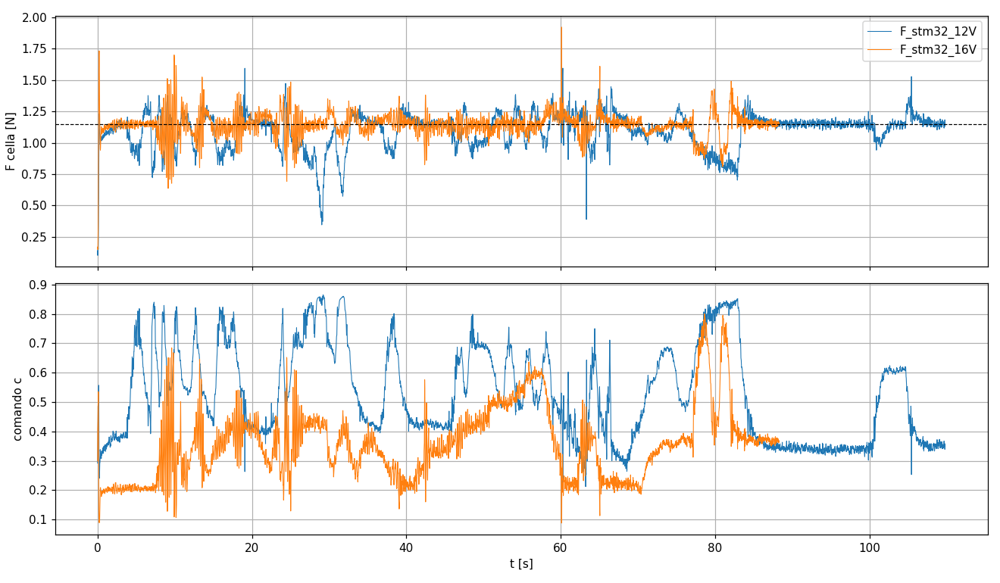

# 8. Report: la policy F gira sullo STM32 (9 ottobre 2026)

Prima prova del banco **senza PC nell'anello di controllo**: la rete SAC (policy F) gira sullo
STM32F407, legge l'HX711 e comanda l'ESC. Il PC serve solo a dare i comandi (zero, start, stop)
e a salvare la telemetria. Tutti i numeri di questo documento sono stati misurati o calcolati
dai file indicati; dove una spiegazione è un'ipotesi, è scritto.

## 8.1 Configurazione

| | |
|---|---|
| Scheda | STM32F407VET6 (black board), 168 MHz, alimentata e collegata al PC solo via USB |
| Firmware | `stm32/firmware/FanStm32` (manuale [07](07_deploy_stm32.md), §7.7) |
| Policy | **F** (`models/sac_F.zip`). Verifica che i pesi sul chip siano proprio questi: `stm32/rete/verifica_pesi.py` → differenza massima **0** con `sac_F.zip` (`sac_E.zip` ha 5 ingressi, non 7) |
| Riferimento | 1.15 N (quello dell'addestramento) |
| Cella | HX711 a **5 V**, calibrazione della sysid v2: k = −199948.5 conteggi/N |
| Cablaggio | ESC → PB6 (TIM4_CH1) · HX711 SCK → PB12, DT → PB13 · masse comuni · BEC dell'ESC scollegato |
| PC | `stm32/monitor_stm32.py`: comandi e salvataggio CSV |

## 8.2 Prestazioni del firmware

| Grandezza | Valore | Fonte |
|---|---|---|
| Autotest della rete sul chip (100 vettori PyTorch) | errore max 2.68·10⁻⁷ → OK | messaggio di avvio |
| Inferenza, build `-O0` | 3 100 163 cicli = **18.45 ms** (92% del passo) | test della rete, 8 ottobre |
| Inferenza, build `-O2` | 702 472 cicli = **4.18 ms** (21% del passo) | idem, e 4190–4196 µs nella telemetria |
| Passo di controllo | 20 ms in **tutte** le 9 908 righe, 0 righe perse | `analizza_prova.py` |
| Età del campione HX711 usato | mediana 5 ms, max 11 ms | colonna `eta_ms` |
| Flash / RAM | 298 904 B (57.0%) / 13 296 B (10.1%) | `arm-none-eabi-size` |

Con `-O0` ogni moltiplicazione-somma costava 46 cicli: il compilatore rilegge e riscrive in
memoria ogni variabile a ogni giro. Con `-O2` scende a 10.4 cicli.

Con PC + Arduino l'anello aveva circa 60 ms di ritardo (3 passi). Sullo STM32 il comando parte
nello stesso passo in cui arriva la misura: il ritardo residuo è l'età del campione (≤ 11 ms)
più l'inferenza (4.2 ms), cioè meno di un passo.

## 8.3 Prove sul banco

Due prove con inclinazioni fatte a mano, con l'unica differenza voluta della **tensione
dell'ESC**. Dati: `data/prove_reali/F_stm32_12V.csv`, `data/prove_reali/F_stm32_16V.csv`.
Analisi: `python stm32/analizza_prova.py <csv...> -o <grafico.png>`.

| | 12 V | 16 V |
|---|---|---|
| Durata | 109.8 s | 88.3 s |
| **RMS errore** (dopo i primi 2 s) | 0.148 N | **0.096 N** |
| Errore medio (ref − F) | +0.051 N | **+0.006 N** |
| Comando medio c | 0.530 | 0.361 |
| Tratto fermo più calmo | 85–100 s: c ≈ 0.35 | 2–5 s: RMS **0.024 N**, c ≈ 0.21 |
| Oscillazione dominante (FFT, 0–10 s) | 0.70 Hz | **4.40 Hz** |

**Attenzione al confronto:** le inclinazioni sono fatte a mano e non sono le stesse nelle due
prove, e non seguono il protocollo della prova E da 175 s ([05](05_prove_sul_banco.md)).
I numeri dicono come si è comportato il banco in queste prove, non sono una misura
"pulita" dell'effetto della tensione.

### Cosa si vede

1. **Il controllo funziona a entrambe le tensioni.** La forza sta intorno a 1.15 N (mediane dopo
   10 s: 1.143 N e 1.149 N), nessuno stop di sicurezza, nessun campione perso.
2. **A 16 V serve meno comando per la stessa forza** (c ≈ 0.21 contro ≈ 0.35 nei tratti fermi).
   La spinta di un'elica cresce circa con il quadrato dei giri, e a parità di comando i giri
   crescono con la tensione: ci si aspetta un fattore dell'ordine di (16/12)² ≈ 1.78. Il rapporto
   dei comandi misurati è 0.35/0.21 ≈ 1.67, dello stesso ordine. In pratica a 16 V il banco ha
   un **guadagno** circa il 70% più alto di quello misurato nella sysid (fatta a 12 V).
3. **12 V:** il recupero dopo un'inclinazione è lento (buchi fino a 0.35 N, comando fino a 0.86),
   ma non ci sono oscillazioni rapide.
4. **16 V:** il recupero è più rapido, ma compaiono **raffiche di oscillazione a ~4.4 Hz**
   (per esempio a 8–11 s, 13–15 s, 24–26 s), soprattutto quando il comando sale oltre ~0.35–0.4.
   Nei tratti a comando basso la forza è molto ferma (0.024 N RMS tra 2 e 5 s).

**Ipotesi (non ancora dimostrata):** la rete è stata addestrata su un banco con il guadagno di
12 V. A 16 V ogni sua correzione produce più forza del previsto e l'anello va in
sovra-correzione. Verifica possibile: in simulazione, moltiplicare la spinta per ~1.7 e
controllare se compaiono oscillazioni a qualche Hz.

**Osservazione aperta:** dalla tabella della sysid, 1.15 N a 12 V richiederebbe u ≈ 8.5,
cioè c ≈ 0.425; nella prova a 12 V il tratto fermo finale sta a c ≈ 0.35. Non so ancora se
dipende dalla corsia non perfettamente in piano in quel tratto o da una differenza reale del
banco rispetto alla sysid.

### Confronto con le prove precedenti

| | RMS errore | Note |
|---|---|---|
| Policy E, PC + Arduino (`E_prova_175s.csv`) | 0.067 N | protocollo 05, ritardo ~3 passi |
| Policy F, simulazione, ritardo 1 passo | 0.096 N | [04](04_ambiente_e_training.md), esperimento F |
| **Policy F, STM32, 16 V** | **0.096 N** | inclinazioni a mano, senza protocollo |
| Policy F, STM32, 12 V | 0.148 N | idem |

Il risultato a 16 V coincide con quello previsto dalla simulazione per un ritardo di un passo.
Non ci sono CSV della policy F provata con PC + Arduino, quindi quel confronto diretto manca.

## 8.4 Cambiare il riferimento senza riaddestrare?

Domanda: si può chiedere 1.0 N o 0.8 N invece di 1.15 N cambiando solo `F_REF` nel firmware?
Prova in simulazione, stesse metriche e stessi seed di `valuta.py`, 20 episodi per caso
(`controller/prova_riferimento.py`):

| Riferimento | RMS nominale | RMS randomizzato | Errore medio (randomizzato) |
|---|---|---|---|
| **1.15 N** (addestramento) | 0.099 N | 0.109 N | +0.003 N |
| 1.00 N | 0.100 N | 0.133 N | −0.039 N |
| 0.80 N | 0.140 N | 0.180 N | −0.109 N |

Più ci si allontana da 1.15 N, più la forza resta **sopra** il riferimento. Motivo: la rete vede
sia la forza assoluta (F/2.5) sia l'errore (e/F_ref), e in addestramento questi due ingressi
erano sempre legati dal riferimento 1.15. Con un altro riferimento gli ingressi diventano una
combinazione mai vista. Per un riferimento diverso la strada corretta è riaddestrare, con il
nuovo valore oppure con il riferimento variabile e incluso nell'osservazione.

## 8.5 Problemi incontrati (dettagli in [06](06_lezioni_imparate.md))

1. Nessuna porta COM: la scheda era rimasta in modalità DFU (PID 0xDF11).
2. "Dispositivo USB sconosciuto": nella flash c'era un altro programma. Il `.elf` era stato aperto
   in CubeProgrammer ma non scritto. Scoperto confrontando il `Reset_Handler` (indirizzo
   0x08000004): 0x0800071D nella flash, 0x08000BA9 nel file.
3. Inferenza da 18 ms: build `Debug` con `-O0`.
4. HX711 sempre a 0: il filo SCK non era su PB12.

## 8.6 Prossimi passi

- [ ] Decidere la tensione di lavoro (verificare che ESC, motore e alimentatore siano dichiarati per 16 V).
- [ ] Se si resta a 16 V: sysid a 16 V e riaddestramento, oppure prima la verifica in simulazione
      dell'ipotesi sul guadagno.
- [ ] Prova lunga con il protocollo del manuale 05, per un confronto diretto con la policy E.
- [ ] HX711 a 3.3 V (come chiede il datasheet: stessa alimentazione del microcontrollore) con
      ricalibrazione, oppure una resistenza da 4.7 kΩ in serie su DT se si resta a 5 V.
