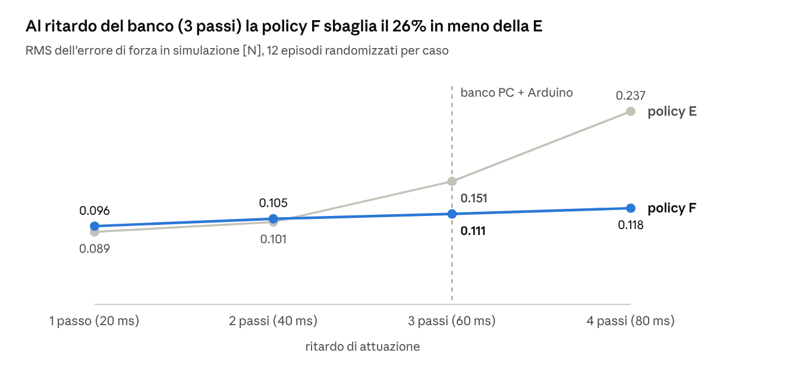

# Manuale FAN\_SAC\_Controller — controllo in forza di un fan con Reinforcement Learning (SAC)

Matteo Faggian · 9 ottobre 2026

> Manuale completo del progetto: teoria (Parte I), pratica (Parte II) e tutorial per rifare l'esperimento (Parte III). Versione modificabile online come documento Claude; i manuali 01–08 restano il dettaglio di ogni fase.

## Introduzione

Una rete neurale addestrata con Soft Actor-Critic (SAC), solo in simulazione, tiene la forza di un fan su una cella di carico a 1.15 N mentre la corsia viene inclinata a mano: sullo STM32F407 l'errore RMS misurato è 0.096 N (ESC a 16 V). Questo manuale spiega perché funziona, come è stato costruito e come rifarlo a casa.

### Il banco

- Un **carrello** da 317 g scorre su una corsia la cui inclinazione θ si cambia a mano. Non c'è nessun sensore di inclinazione.
- Sul carrello c'è un **fan** (motore brushless + elica) pilotato da un **ESC**, usato come bidirezionale.
- In fondo alla corsia una **load cell da 1 kg**, letta da un **HX711**, misura la forza con cui il carrello la spinge.
- Un **alimentatore da banco** con limite di corrente alimenta l'ESC: la spinta massima utile è circa 2.2 N.
- Il controllore è prima un **PC + Arduino**, poi uno **STM32F407VET6** che esegue la rete da solo.

### L'obiettivo

Tenere la forza misurata uguale al riferimento, F = 1.15 N, qualunque sia θ entro ±14°. La rete **non vede** θ: deve dedurlo dall'effetto che ha sulla forza e compensarlo.

### Perché RL puro

Il progetto è un esercizio per capire il Reinforcement Learning dall'inizio alla fine. Per questo il controllo è solo la rete SAC, senza PID e senza schemi ibridi. Un PID farebbe probabilmente bene questo lavoro; qui non è la domanda.

### La pipeline

1. **Banco reale → dati.** Test di caratterizzazione (system identification) con l'Arduino.
2. **Dati → modello.** Stima dei parametri fisici: mappa comando→spinta, costanti di tempo, ritardi, rumore.
3. **Modello → simulatore.** Ambiente Gymnasium (`env_fan.py`) con parametri randomizzati attorno ai valori misurati.
4. **Simulatore → policy.** Training SAC con Stable-Baselines3, 300k passi.
5. **Policy → banco con PC + Arduino.** La rete gira sul PC, l'Arduino fa da ponte.
6. **Policy → STM32.** La rete, riscritta in C, gira sul microcontrollore a 50 Hz.

### Come leggere il manuale

- **Parte I – Teoria:** la fisica del banco e la teoria del RL e del SAC, derivate da zero.
- **Parte II – Pratica:** cosa è stato fatto davvero, con i numeri misurati e i problemi incontrati.
- **Parte III – Tutorial:** la procedura passo passo per rifare l'esperimento.

Ogni numero viene dal repository [matteo-faggian/fan-sac-controller](https://github.com/matteo-faggian/fan-sac-controller) (dati, codice, manuali 01–08, appunti in PDF). Quando qualcosa è un'ipotesi non verificata, è scritto.

## Parte I – Teoria fisica del banco

La cella misura la spinta meno la componente del peso lungo la corsia: per tenere 1.15 N il fan deve dare tra 0.40 e 1.90 N, e questo fissa θmax ≈ 14°.

### 1. Equilibrio del carrello

Asse x lungo la corsia, positivo verso la cella; θ > 0 quando la cella sta più in alto del carrello. Sul carrello agiscono la spinta T del fan, la componente del peso −mg sinθ e la reazione della cella −N. Il carrello è appoggiato alla cella e fermo, quindi l'accelerazione è nulla:

$$
T - m g \sin\theta - N = 0 \quad\Rightarrow\quad N = T - m g \sin\theta
$$

La cella legge N più un errore di zero b (bias) e un rumore n:

$$
F_{lc} = T - m g \sin\theta + b + n
$$

Ipotesi: carrello sempre in contatto con la cella, attriti piccoli rispetto a T. L'attrito residuo finisce nel bias b, che in training viene randomizzato.

### 2. Dimensionamento del compito

Per avere F = Fref serve T = Fref + mg sinθ. Con θ in \[−θmax, +θmax\] la spinta richiesta va da Fref − mg sinθmax a Fref + mg sinθmax. Questo intervallo deve stare dove il motore lavora bene, misurato con la sysid: sopra \~0.4 N (lontano dalla soglia di arresto) e sotto \~1.9 N (margine dalla saturazione a \~2.2 N data dall'alimentatore). Il centro della zona utile e il margine danno:

$$
F_{ref} = \frac{0.4 + 1.9}{2} = 1.15\ \text{N}, \qquad \sin\theta_{max} \le \frac{1.9 - 1.15}{0.317 \cdot 9.81} = 0.241 \;\Rightarrow\; \theta_{max} \approx 14^\circ
$$

Scelta di progetto: invece di alzare il limite di corrente dell'alimentatore si è ridotta l'inclinazione massima.

### 3. Il rotore come sistema del primo ordine

Il rotore è un'inerzia J accelerata dalla coppia del motore Qm e frenata dalla coppia aerodinamica Qa:

$$
J\,\dot\omega = Q_m(u,\omega) - Q_a(\omega)
$$

L'ESC regola la velocità in modo che, a regime, ω dipenda solo dal comando u. Linearizzando attorno a un punto di lavoro, per le piccole variazioni:

$$
J\,\delta\dot\omega = -k_\omega\,\delta\omega + k_u\,\delta u \quad\Rightarrow\quad \tau = \frac{J}{k_\omega}
$$

La spinta è una funzione regolare di ω (circa T ∝ ω²), quindi anche le piccole variazioni di spinta seguono un primo ordine. Con T\* = spinta di regime al comando u:

$$
\dot T = \frac{T^*(u) - T}{\tau}
$$

La validità è verificata sui dati: le risposte ai gradini si sovrappongono a un primo ordine con ritardo puro. La dispersione di τ (33–112 ms) dice che la linearizzazione vale solo localmente; per questo τ è randomizzata in training.

### 4. Discretizzazione esatta

Il controllore agisce ogni Δt = 20 ms e tiene il comando costante nel passo (zero-order hold). Con T\* costante nel passo la soluzione esatta dell'equazione è:

$$
T(t_k+\Delta t) = T^* + \big(T(t_k) - T^*\big)e^{-\Delta t/\tau} \;\Rightarrow\; T_{k+1} = T_k + \alpha\,(T^* - T_k), \quad \alpha = 1 - e^{-\Delta t/\tau}
$$

Con τ = 78 ms: α = 1 − e^(−0.02/0.078) = 0.226. Eulero darebbe α = Δt/τ = 0.256, cioè il 13% di errore, il 27% per τ ≈ 40 ms, e diventerebbe instabile per τ < 10 ms. La formula esatta vale per ogni τ > 0.

### 5. Deadband con isteresi e ritardi

Dai dati: da fermo il motore parte solo con u ≥ 1.5 e impiega \~200 ms prima di spingere; in moto si ferma solo con u < 0.5. Si modella con due stati:

| Stato | Condizione | Cosa succede |
| --- | --- | --- |
| fermo | u ≥ u\_avvio per 10 passi consecutivi (200 ms) | passa a "in moto" |
| fermo | altrimenti | T decade verso 0 con τ\_off = 174 ms |
| in moto | u < u\_arresto | passa a "fermo" |
| in moto | altrimenti | T tende a g·T\*(u) con τ\_on = 78 ms |

τ\_off > τ\_on perché in spegnimento il rotore rallenta solo per attrito e aria, senza frenata attiva. Il **ritardo di attuazione** è una coda FIFO di n passi: il comando applicato al passo k è quello calcolato al passo k − n.

### 6. Misura: load cell e HX711

La load cell è un ponte di estensimetri: la forza deforma il corpo, la resistenza cambia, il ponte dà una tensione di pochi mV. L'HX711 è un ADC a 24 bit con amplificatore (canale A, guadagno 128). La conversione in newton è una retta a due punti:

$$
F = \frac{raw - raw_0}{k}, \qquad k = \frac{raw_{peso} - raw_0}{m\,g}
$$

Valore usato: k = −199 948.5 conteggi/N (massa nota 317 g). Il rumore misurato cresce con la spinta, perché a motore acceso domina la vibrazione:

$$
n \sim \mathcal{N}(0,\sigma^2), \qquad \sigma = s_0 + s_1\,|T|, \quad s_0 = 1.1\ \text{mN},\ s_1 = 0.0208
$$

A T = 1.15 N, σ ≈ 25 mN. Frequenza di campionamento: il pin RATE a GND dà 10 Hz, a VCC \~100 Hz misurati. Con τ = 78 ms, a 10 Hz si avrebbe meno di un campione per costante di tempo: per questo il modulo è stato modificato (Parte II).

## Parte I – Teoria del Reinforcement Learning e del SAC

Il controllo è formulato come un processo decisionale di Markov a 50 Hz: osservazione di 7 numeri, un'azione in \[−1, 1\], un reward che punisce errore e comando nervoso; SAC impara la policy massimizzando reward ed entropia.

### 1. Il ciclo del RL

A ogni passo k (Δt = 20 ms):

1. l'ambiente dà un'**osservazione** o\_k alla rete;
2. la rete (la **policy** π) sceglie un'**azione** a\_k, cioè il comando al fan;
3. il sistema avanza di un passo e restituisce un **reward** r\_k, un numero che dice quanto è andato bene quel passo.

Un episodio di training dura 1000 passi (20 s), parte con motore fermo e inclinazione casuale. L'obiettivo è la policy che massimizza il **ritorno scontato** atteso:

$$
G = \mathbb{E}\Big[\sum_{k} \gamma^k r_k\Big], \qquad H \approx \frac{1}{1-\gamma} = 100\ \text{passi} = 2\ \text{s} \quad (\gamma = 0.99)
$$

γ fissa l'orizzonte: l'errore lasciato da un cambio di inclinazione dura secondi, e con γ = 0.98 (H = 1 s) il beneficio di correggerlo era poco visibile.

### 2. Proprietà di Markov

Il RL presuppone che l'osservazione contenga tutto ciò che serve a prevedere il futuro. Con un ritardo di n passi, i comandi già inviati ma non ancora arrivati al motore fanno parte dello stato. Se la rete non li vede, non sa che una correzione è "in viaggio", ne aggiunge un'altra e innesca un'oscillazione. Da qui la storia dei comandi nell'osservazione.

### 3. Osservazione (7 valori, policy F)

| # | Grandezza | Normalizzazione | Perché |
| --- | --- | --- | --- |
| 0 | forza misurata F | / 2.5 N | 2.5 N ≈ spinta massima: valore circa in \[0, 1\] |
| 1 | errore e = Fref − F | / 1.15 N | la grandezza da annullare |
| 2 | variazione di F filtrata | / 2.5 N | la tendenza |
| 3–5 | ultimi 3 comandi c | già in \[0, 1\] | i comandi "in viaggio" (Markov) |
| 6 | integrale dell'errore | / 0.5 N·s | elimina l'errore a regime |

L'inclinazione **non** è osservata: è il disturbo. La derivata è filtrata con un filtro esponenziale (β = 0.2), perché la differenza tra due campioni è dominata dal rumore:

$$
\widehat{\Delta F}_k = \widehat{\Delta F}_{k-1} + \beta\big((F_k - F_{k-1}) - \widehat{\Delta F}_{k-1}\big), \qquad \tau_{EMA} = \frac{-\Delta t}{\ln(1-\beta)} \approx 90\ \text{ms}
$$

L'integrale è saturato (anti-windup):

$$
I_k = \mathrm{clip}\big(I_{k-1} + e_k\,\Delta t,\; -I_{max},\; I_{max}\big), \qquad I_{max} = 0.5\ \text{N\,s}
$$

I\_max fissa anche la **sensibilità** dell'ingresso: con un errore di 0.1 N, I/I\_max cresce di 0.2 al secondo. Con I\_max = 2 cresceva di 0.05 al secondo, troppo poco perché la rete lo usasse.

### 4. Azione

La rete produce a in \[−1, 1\], convertito nel comando del banco:

$$
c = c_{min} + (1 - c_{min})\,\frac{a+1}{2}, \qquad u = 20\,c, \qquad c_{min} = 0.05
$$

Quindi u ∈ \[1, 20\]: il minimo sta sopra la soglia di arresto (0.5), così la rete non può spegnere il motore (una ripartenza costa 200 ms); il massimo è dove la mappa satura.

### 5. Reward

$$
r = -e_n^2 - w_{e1}\,|e_n| - w_{\Delta}\,(\Delta c)^2 - w_u\,c^2, \qquad e_n = \frac{e}{F_{ref}}, \quad w_{e1} = 1,\; w_{\Delta} = 5,\; w_u = 0.01
$$

- e\_n² punisce molto gli errori grandi, ma vicino a zero è piatto (derivata 2e\_n → 0).
- |e\_n| ha derivata costante: un errore persistente di 0.15 N (e\_n = 0.130) costa 0.017 per passo col quadratico e 0.130 col lineare, circa 8 volte di più.
- (Δc)² punisce un comando che salta da un passo all'altro.
- c² è una piccola penalità sullo sforzo.

### 6. SAC: obiettivo con entropia

SAC massimizza il ritorno più un premio di **entropia**, che misura quanto è "larga" la distribuzione delle azioni:

$$
J(\pi) = \mathbb{E}\Big[\sum_k \gamma^k\big(r_k + \alpha\,\mathcal{H}(\pi(\cdot|s_k))\big)\Big], \qquad \mathcal{H} = -\mathbb{E}_{a\sim\pi}[\log \pi(a|s)]
$$

La temperatura α pesa l'esplorazione e impedisce che la policy diventi deterministica troppo presto.

### 7. Critic: la Q "soft"

Il critic stima Q(s, a): il ritorno atteso partendo da s con l'azione a e poi seguendo π. Vale l'equazione di Bellman con entropia:

$$
Q(s,a) = r + \gamma\,\mathbb{E}_{s',\,a'\sim\pi}\big[Q(s',a') - \alpha\log\pi(a'|s')\big]
$$

Si usano due critic e, nel bersaglio, il minimo delle loro copie "lente" (target network), per ridurre la sovrastima di Q:

$$
y = r + \gamma\Big(\min_{j=1,2} Q_{\bar\phi_j}(s',a') - \alpha\log\pi(a'|s')\Big), \qquad \mathcal{L}_Q = \mathbb{E}\big[(Q_{\phi_j}(s,a) - y)^2\big]
$$

Le target seguono le reti principali con una media mobile, φ̄ ← 0.005·φ + 0.995·φ̄.

### 8. Actor e riparametrizzazione

L'actor dà media μ e deviazione σ di una gaussiana, poi schiaccia con tanh. Per derivare attraverso il campionamento si scrive l'azione come funzione di un rumore esterno ε:

$$
a = \tanh\big(\mu_\theta(s) + \sigma_\theta(s)\,\varepsilon\big),\quad \varepsilon\sim\mathcal{N}(0,1), \qquad \mathcal{L}_\pi = \mathbb{E}\Big[\alpha\log\pi_\theta(a|s) - \min_j Q_{\phi_j}(s,a)\Big]
$$

Correzione della tanh (cambio di variabile di una densità, con z = μ + σε):

$$
\log\pi(a|s) = \log\mathcal{N}(z;\mu,\sigma^2) - \log\big(1 - \tanh^2 z\big)
$$

Senza questo termine la policy verrebbe premiata per spingere z verso valori enormi (azioni saturate a ±1).

### 9. Temperatura automatica

α non è fissata a mano: è regolata per tenere l'entropia attorno a un obiettivo, in Stable-Baselines3 −dim(azione) = −1:

$$
\mathcal{L}_\alpha = \mathbb{E}_{a\sim\pi}\big[-\alpha\,(\log\pi(a|s) + \bar{\mathcal{H}})\big]
$$

Se l'entropia scende sotto l'obiettivo, α cresce: è un anello di controllo sull'esplorazione.

### 10. Off-policy e replay buffer

Ogni transizione (s, a, r, s') va in un buffer da 200 000 elementi; le reti si aggiornano su minibatch da 256 estratti a caso, anche se raccolti da versioni vecchie della policy. Questo rende SAC efficiente nei campioni.

### 11. Domain randomization

Il simulatore non sarà mai identico al banco. Si addestra quindi su una **famiglia** di modelli: a ogni episodio i parametri sono estratti attorno ai valori misurati. Se il banco sta dentro la famiglia, la policy ha buone probabilità di funzionare anche lì (sim-to-real).

| Parametro | Intervallo |
| --- | --- |
| massa | ×0.95 – 1.05 |
| guadagno di spinta | ×0.85 – 1.15 |
| τ in moto | \~40 – 112 ms |
| τ in spegnimento | ×0.85 – 1.15 |
| soglia di avvio | ×0.8 – 1.3 |
| soglia di arresto | ×0.6 – 1.6, ≤ soglia di avvio |
| ritardo di avvio | ×0.75 – 1.25 |
| ritardo di attuazione | 1–4 passi (20–80 ms) |
| rumore proporzionale | ×0.7 – 1.5 |
| bias | −0.05 … +0.18 N |
| inclinazione | ±14°, gradino o rampa (0.5–3 s) ogni 2–6 s |

Regola imparata: la randomizzazione deve **contenere la realtà con margine**.

## Parte II – Hardware, cablaggio e firmware Arduino

Il banco funziona solo con tre accorgimenti: ESC trattato come bidirezionale (neutro 1472 µs), HX711 modificato a \~100 Hz, comandi seriali con cifra di controllo.

### Componenti

| Componente | Ruolo | Note |
| --- | --- | --- |
| Fan brushless + elica | genera la spinta T | elica sempre serrata |
| ESC (bidirezionale) | pilota il motore con un impulso tipo servo | neutro a metà corsa |
| Load cell 1 kg + HX711 | misura la forza sulla cella | RATE modificato a \~100 Hz |
| Corsia inclinabile + carrello (317 g) | crea il disturbo mg sinθ | inclinazione a mano |
| Arduino (Uno/Nano) | ponte PC ↔ ESC/HX711 | firmware `banco_sysid_v2.ino` |
| STM32F407VET6 (black board) | controllore stand-alone | Cortex-M4F con FPU, 512 KB flash |
| Alimentatore da banco | alimenta l'ESC | limite di corrente: spinta max \~2.2 N |

### Cablaggio con Arduino

| Segnale | Pin Arduino |
| --- | --- |
| ESC segnale | D9 |
| ESC massa | GND (massa comune obbligatoria) |
| HX711 SCK | D2 |
| HX711 DT | D3 |
| HX711 VCC / GND | 5V / GND |

Il filo rosso (5 V del BEC) del connettore ESC resta **scollegato**: la scheda è già alimentata dalla USB e non si mettono in parallelo due alimentazioni. I fili HX711 vanno saldati o fissati: un contatto intermittente ha fatto perdere la misura durante una prova.

### ESC bidirezionale: la mappatura

L'ESC ha lo zero a metà corsa. Con `attach()` di default la libreria Servo usa 544–2400 µs; `Servo.write(90)` dà 1472 µs = motore fermo, e la piena potenza nel verso che carica la cella è 544 µs. Il comando u ∈ \[0, 40\] diventa:

$$
t_{imp} = 1472 - \frac{u}{40}\,(1472 - 544)\ [\mu s]
$$

L'impulso **diminuisce** quando la spinta aumenta. Limiti: u ≤ 20 nella policy, u ≤ 25 nel firmware. Prima di tutto va verificato il tipo di ESC con lo sketch `esc_manual_control.ino` (0–180, 90 = neutro): nel primo test gli impulsi 1000–1400 µs cadevano nella zona di retromarcia e il motore non girava.

### Modifica dell'HX711: da 10 a \~100 campioni/s

Il pin 15 (RATE) sceglie la frequenza: a GND 10 Hz, a VCC 80 Hz nominali (\~99.6 Hz misurati su questo modulo). Sul modulo era saldato a GND. Modifica: **pin 15 staccato da GND e collegato al pin 16 (DVDD)**.

### Calibrazione della cella

Retta a due punti: zero a cella scarica e massa nota da 317 g. Due calibrazioni hanno dato valori diversi del 17%, probabilmente per il punto di appoggio del peso: va appoggiato dove spinge il carrello. L'incertezza è coperta in training dal guadagno randomizzato ±15%. Lo zero si rimisura a ogni prova.

### Firmware Arduino e protocollo

L'Arduino non decide niente: riceve u dal PC, lo applica all'ESC e a ogni campione HX711 manda `t_us,raw,u_us,n_scartati` (115200 baud). Tutta la logica sta sul PC.

**Formato del comando:** 6 caratteri fissi più a capo, `U dddd c`, dove dddd = u·100 (0000–2500) e c = (somma delle 4 cifre) mod 10. Esempio: `U10001` → u = 10.00. Una riga con lunghezza o cifra sbagliata viene scartata.

Perché: nella prima versione la libreria HX711 disabilitava gli interrupt e la UART perdeva caratteri; `U 10.0000` diventava `U 0.0000` (stop) o `U 100000` (**piena potenza**), circa ogni 2 s. Soluzione: lettura HX711 scritta a mano (24 impulsi + 1 per canale A guadagno 128) senza bloccare gli interrupt, più il formato fisso. Unico vincolo del chip: SCK alto per meno di 60 µs. `raw = -1` (tutti i bit a 1) significa DT sempre alta, cioè HX711 non alimentato o filo staccato.

**Watchdog:** senza comandi validi per 500 ms l'impulso torna al neutro.

### Latenza della catena PC + Arduino

| Passaggio | Tempo tipico |
| --- | --- |
| Conversione HX711 | fino a 10 ms |
| Seriale + USB + Windows | \~5–10 ms |
| Attesa del periodo ESC (50 Hz) | 0–20 ms |
| Ritardo puro ESC + motore (misurato) | \~27 ms |

In anello chiuso il banco si comporta come un ritardo di \~3 passi (\~60 ms): è il numero che ha guidato l'esperimento F.

## Parte II – System identification, simulatore, training e prove sul banco

Il simulatore costruito sui dati misurati riproduce il banco con \~0.07 N di errore RMS; la policy E sul banco ha dato 0.067 N, la policy F sullo STM32 0.096 N, come previsto dalla simulazione.

### 1. System identification

La policy impara **solo nel simulatore**. Se il simulatore è diverso dal banco, impara una strategia ottima per un sistema che non esiste (sim-to-real gap). La sysid misura il banco e ne ricava i parametri: è stima di parametri classica, un modello fisico scelto da noi e un fit ai minimi quadrati.

**Acquisizione** (`sysid/sysid_acquisizione_v2.py`, \~4 minuti, firmware `banco_sysid_v2.ino`):

| Fase | Comando | Cosa misura |
| --- | --- | --- |
| cal\_zero | motore fermo, cella scarica | offset; verifica HX711 a \~100 Hz |
| cal\_peso | motore fermo, 317 g sulla cella | fattore di scala conteggi → N |
| rumore\_fermo | 30 s fermo | rumore elettrico |
| statica\_su / statica\_giu | scalini da 4 s, 0 → 20 → 0 | mappa statica, deadband, isteresi |
| gradino | salti tra due livelli, ×4 | costante di tempo e ritardo in moto |
| partenza | da fermo a u = 10, ×4 | ritardo di avvio |
| zero\_fine | 15 s fermo | spostamento dello zero |

**Analisi** (`sysid/analisi_sysid.py`): calibrazione a due punti; rumore con la MAD (mediana degli scarti assoluti × 1.4826, stima di σ insensibile ai campioni anomali); mappa statica con la mediana di ogni scalino dopo 1.5 s di transitorio; per ogni gradino un fit ai minimi quadrati del primo ordine con ritardo:

$$
F(t) = \begin{cases} F_0 & t < L \\ F_0 + (F_1 - F_0)\left(1 - e^{-(t-L)/\tau}\right) & t \ge L \end{cases}
$$

I gradini sono allineati all'istante in cui l'Arduino ha cambiato davvero l'impulso (colonna `u_us`), così L misura solo il ritardo fisico.

| Parametro | Valore misurato |
| --- | --- |
| Mappa comando → spinta | quasi lineare, \~0.11 N per unità di u, satura a u ≈ 18 |
| Spinta massima | \~2.2 N (limitata dall'alimentatore) |
| Soglie avvio / arresto | u > 1.5 / u < 0.5 |
| τ in moto | 78 ms (33–112 ms) |
| τ in spegnimento | 174 ms |
| Ritardo in moto | 27 ms |
| Ritardo di avvio da fermo | 200 ms |
| Rumore | 1.1 mN + 2.08% della spinta |
| Spostamento dello zero dopo i test | +0.13 N |
| Frequenza HX711 | \~99.6 Hz |

Tutto finisce in `controller/sysid_params.json`. **Validazione:** stessa sequenza di comandi data al simulatore e al banco: RMS della differenza 0.083 N, 0.069 N togliendo lo spostamento medio dello zero.

### 2. Training

`controller/env_fan.py`: ambiente Gymnasium + SAC di Stable-Baselines3. Iperparametri: learning rate 3·10⁻⁴, buffer 200k, batch 256, γ = 0.99, 300k passi (\~1.5 h su CPU), reti 2 × 256 ReLU (default). Un `EvalCallback` valuta ogni 5000 passi su 5 episodi nominali e salva il migliore in `best_sac_fan/best_model.zip`.

Il reward cambia tra esperimenti, quindi non è confrontabile: si confrontano metriche fisiche, su 20 episodi randomizzati con gli stessi seed.

| Esp. | Modifica | RMS | Offset lento | Cosa ha insegnato |
| --- | --- | --- | --- | --- |
| A | modello dalla sysid, reward e\_n², γ = 0.98 | 0.136 N | 0.106 N | errore costante dopo ogni inclinazione |
| D | + termine \|e\_n\|, γ = 0.99, 300k passi | 0.117 N | 0.085 N | reward shaping: offset −20%, comando più nervoso |
| E | + I\_max 2 → 0.5, c\_min = 0.05 | 0.090 N | 0.049 N | la scala degli ingressi conta quanto il reward |
| F | + ritardo 1–4 passi, ultimi 3 comandi osservati | 0.096–0.118 N | 0.049–0.052 N | robustezza al ritardo; migliore a 110k passi |

### 3. Prove sul banco

**Policy E con PC + Arduino** (`controller/controllo_reale.py`): RMS 0.067 N su 175 s, errore medio +0.003 N, 0.022–0.030 N a corsia ferma. Ma la FFT dell'errore mostrava un picco a \~3 Hz, presente anche nel comando: oscillazione d'anello. In simulazione la policy E riproduce lo stesso spettro con 3 passi di ritardo; era stata addestrata con 1–2.

**Esperimento F:** ritardo randomizzato 1–4 passi e storia dei comandi nell'osservazione. Valutazione col ritardo forzato:



*Fonte: docs/04_ambiente_e_training.md, esperimento F, ritardo forzato a 1–4 passi.*

Al ritardo del banco F riduce l'errore del 26% e l'oscillazione a \~3 Hz da 56% a 20% della varianza; a 4 passi E è vicina all'instabilità mentre F peggiora poco. Il prezzo: con 1–2 passi F è un po' peggiore di E (robustezza contro prestazioni nominali). La policy F è stata poi provata con PC + Arduino con esito positivo osservato, ma il CSV di quella prova non è archiviato.

**Policy F sullo STM32** (9 ottobre 2026, riferimento 1.15 N, inclinazioni a mano):

|  | ESC a 12 V | ESC a 16 V |
| --- | --- | --- |
| Durata | 109.8 s | 88.3 s |
| RMS errore (dopo 2 s) | 0.148 N | 0.096 N |
| Errore medio | +0.051 N | +0.006 N |
| Comando medio c | 0.530 | 0.361 |
| Oscillazione dominante (FFT 0–10 s) | 0.70 Hz | 4.40 Hz |

A 16 V il risultato coincide con la simulazione a 1 passo di ritardo (0.096 N). A 16 V serve meno comando per la stessa forza (c ≈ 0.21 contro ≈ 0.35 nei tratti fermi), rapporto 1.67, dello stesso ordine di (16/12)² ≈ 1.78 atteso se la spinta cresce col quadrato dei giri. Le raffiche a \~4.4 Hz a 16 V potrebbero venire da questo guadagno più alto di quello visto in training: è un'**ipotesi non ancora verificata**. Le inclinazioni non erano uguali nelle due prove, quindi il confronto non è una misura pulita dell'effetto della tensione.

**Cambiare il riferimento senza riaddestrare** peggiora: in simulazione RMS randomizzato 0.109 N a 1.15 N, 0.133 N a 1.00 N, 0.180 N a 0.80 N, con la forza che resta sopra il riferimento. La rete ha sempre visto F/2.5 ed e/1.15 legati dallo stesso riferimento: per un altro valore va riaddestrata.

## Parte II – Deploy sullo STM32F407

La rete (68 097 parametri, 266 KB) gira sullo STM32F407 in 4.18 ms per passo con `-O2`, calcola la stessa funzione di PyTorch con errore massimo 2.7·10⁻⁷, e l'anello scende sotto un passo di ritardo.

### 1. Perché il F407 e non il BluePill

L'actor è una rete 7 → 256 → 256 → 1:

$$
N = (7\cdot256 + 256) + (256\cdot256 + 256) + (256 + 1) = 68\,097 \quad\Rightarrow\quad 68\,097 \times 4\ \text{byte} \approx 266\ \text{KB}
$$

|  | BluePill (F103C8T6) | Black board (F407VET6) |
| --- | --- | --- |
| Core | Cortex-M3, 72 MHz | Cortex-M4F, 168 MHz |
| FPU | no (float emulato) | sì, singola precisione |
| Flash / RAM | 64 KB / 20 KB | 512 KB / 192 KB |

Sul BluePill la rete non sta in flash. Le famiglie F0, G0, L0 (Cortex-M0/M0+) non hanno FPU: per reti in float servono F4, G4, L4.

### 2. La rete in C, scritta a mano

In inferenza deterministica la policy SAC calcola solo la media, schiacciata dalla tanh:

$$
a = \tanh\Big(W_\mu\,\mathrm{ReLU}\big(W_2\,\mathrm{ReLU}(W_1 x + b_1) + b_2\big) + b_\mu\Big)
$$

Il ramo log\_std serve solo in training e non si esporta. Sono tre prodotti matrice-vettore: \~30 righe di C senza librerie.

| File (`stm32/rete/`) | Ruolo |
| --- | --- |
| `esporta_actor.py` | legge il `.zip` e genera `actor_weights.h` e `test_vectors.h` |
| `actor.c`, `actor.h` | inferenza in C puro |
| `test_pc.c` | confronta C e PyTorch su 100 vettori di test |
| `verifica_pesi.py` | controlla che i pesi sul chip siano quelli di `sac_F.zip` |

La matrice W (uscite × ingressi) è salvata riga per riga: W\_rc sta in posizione `r*n_in + c`, lo stesso ordine di `Linear.weight` in PyTorch. Gli array sono `static const`, quindi stanno in **flash**; in RAM servono solo i due vettori nascosti (2 KB). Verifica sul PC: errore massimo 3.87·10⁻⁷ su 100 test, cioè arrotondamento della precisione singola.

### 3. Clock a 168 MHz

Quarzo esterno da 8 MHz (HSE) e PLL:

$$
f_{in} = \frac{8}{M=8} = 1\ \text{MHz},\quad f_{VCO} = 1 \cdot 336 = 336\ \text{MHz},\quad f_{SYS} = \frac{336}{2} = 168\ \text{MHz},\quad f_{USB} = \frac{336}{7} = 48\ \text{MHz}
$$

La USB vuole esattamente 48 MHz: è il vincolo che fissa f\_VCO e Q. Prescaler: AHB /1 = 168 MHz, APB1 /4 = 42 MHz, APB2 /2 = 84 MHz. Con prescaler diverso da 1 i timer ricevono il doppio della frequenza del bus: i timer di APB1 contano a 84 MHz. Errore incontrato: con N = 136 tutto risultava a 68 MHz e la USB a 19.43 MHz (136/7); ripercorrere la catena dei divisori trova il valore sbagliato.

### 4. Una sola USB per caricare e comunicare

| Momento | BT0 | Chi gestisce la USB | Il PC vede |
| --- | --- | --- | --- |
| Caricare il firmware | 3.3V | bootloader di fabbrica (DFU) | "STM32 BOOTLOADER" (PID 0xDF11) |
| Usare il firmware | GND | il nostro programma (CDC) | una porta `COMx` (PID 0x5740) |

BT1 resta sempre a GND. In CubeMX: USB\_OTG\_FS in `Device_Only` (PA11/PA12), USB\_DEVICE classe `Communication Device Class (Virtual Port Com)`, SYS Debug `Serial Wire`, PA6 come LED. Prezzo: niente debug passo-passo, la verifica si fa stampando sulla seriale.

### 5. Il firmware di controllo

`stm32/firmware/FanStm32/Core/Src/main.c` fa sullo STM32 quello che `controllo_reale.py` faceva sul PC, con timer e pin configurati direttamente nei registri.

| Da | Pin STM32 | Note |
| --- | --- | --- |
| ESC segnale | PB6 | TIM4 canale 1, AF2 |
| ESC massa | GND | riferimento del segnale |
| ESC rosso (BEC 5 V) | — | non collegato |
| HX711 SCK | PB12 | uscita push-pull |
| HX711 DT | PB13 | ingresso con pull-up: filo staccato → DT alto → stop |
| HX711 VCC / GND | 5 V / GND | vedi nota |

**PWM:** timer a 84 MHz, PSC = 83 → 1 tick = 1 µs, ARR = 19999 → 20 ms (50 Hz). Mappatura identica all'Arduino: µs = 1472 − round(u/40 × 928), u limitato a \[0, 25\].

**Ciclo a 50 Hz:** F = (raw − raw\_zero)/k → derivata filtrata (β = 0.2) → e = 1.15 − F → integrale saturato → 7 ingressi → rete → c = 0.05 + 0.95·(a+1)/2 → u = 20c → impulso. La memoria dei comandi si aggiorna **dopo** il calcolo del nuovo, come in training.

**Sicurezza:** neutro all'accensione, autotest della rete, 3 s per armare l'ESC; watchdog indipendente (IWDG, reset dopo \~0.5 s di blocco); stop se |F| > 8 N, se manca un campione valido da 100 ms, dopo 180 s. La telemetria USB non rallenta mai il controllo: se la USB è occupata la riga si scarta.

**Comandi seriali:** `Z` zero, `K` calibrazione con 317 g, `S` avvio, `X` stop, `P` stato, `H` aiuto. Telemetria CSV: `t_ms, F_mN, c_x1000, u_us, inferenza_us, eta_ms`.

**Nota sulla tensione dell'HX711:** il datasheet chiede la stessa alimentazione del microcontrollore. A 5 V funziona, ma non è verificato che PB13 tolleri i 5 V di DT. Alternative: HX711 a 3.3 V con ricalibrazione, oppure 4.7 kΩ in serie su DT.

### 6. Prestazioni misurate

| Grandezza | Valore |
| --- | --- |
| Inferenza, build `-O0` | 3 100 163 cicli = 18.45 ms (92% del passo) |
| Inferenza, build `-O2` | 702 472 cicli = 4.18 ms (21% del passo) |
| Passo di controllo | 20 ms in tutte le 9 908 righe, 0 perse |
| Età del campione HX711 | mediana 5 ms, max 11 ms |
| Flash / RAM | 298 904 B (57.0%) / 13 296 B (10.1%) |

Con `-O0` ogni moltiplicazione-somma costava 46 cicli, con `-O2` 10.4. Il ritardo residuo dell'anello è l'età del campione (≤ 11 ms) più l'inferenza (4.2 ms): meno di un passo, contro i \~3 di PC + Arduino.

## Parte III – Tutorial: rifare l'esperimento a casa

Sette fasi, ognuna con una verifica prima di passare alla successiva: banco → ESC → sysid → training → prova con PC + Arduino → rete in C → prova con lo STM32.

### Materiale

- Fan brushless con elica + ESC (verificare se è bidirezionale)
- Load cell da 1 kg + modulo HX711 (con il pin RATE accessibile per la modifica)
- Corsia inclinabile e carrello leggero; una massa nota (qui il carrello stesso, 317 g, pesato)
- Arduino Uno o Nano, cavo USB
- STM32F407VET6 "black board" con quarzo da 8 MHz e micro USB (opzionale, per il deploy)
- Alimentatore da banco con limite di corrente
- Saldatore, cavetti, una resistenza da 4.7 kΩ (opzionale, per DT a 5 V sullo STM32)
- PC con Python 3, Arduino IDE, STM32CubeIDE, STM32CubeProgrammer, gcc

### Sicurezza, prima di tutto

- [ ] Elica serrata, banco fissato, mani e cavi lontani dall'elica.
- [ ] Limite di corrente impostato sull'alimentatore prima di collegare l'ESC.
- [ ] Firmware con watchdog caricato **prima** di dare alimentazione all'ESC.
- [ ] Masse comuni tra ESC e scheda; filo rosso del BEC scollegato.
- [ ] Sapere dove sono: interruttore dell'alimentatore, `X` (STM32) o Ctrl+C (PC).

### Fase 0 – Scaricare il progetto

```bash
git clone https://github.com/matteo-faggian/fan-sac-controller.git
cd fan-sac-controller
pip install -r requirements.txt
```

### Fase 1 – Costruire e cablare il banco

1. Monta la cella in fondo alla corsia, nel punto in cui il carrello la spinge.
2. Modifica l'HX711: stacca il pin 15 (RATE) da GND e collegalo al pin 16 (DVDD). Senza questa modifica si campiona a 10 Hz e il controllo è impossibile.
3. Collega all'Arduino: ESC segnale D9, ESC massa GND, HX711 SCK D2, DT D3, VCC 5V, GND. Salda o fissa i fili dell'HX711.
4. **Verifica:** nel passo successivo la frequenza HX711 deve risultare \~100 Hz, calcolata dai timestamp dell'Arduino.

### Fase 2 – Capire l'ESC

1. Carica `firmware/esc_manual_control/esc_manual_control.ino`.
2. Dal monitor seriale manda 90 (neutro), poi valori via via più lontani: trova da che parte il motore spinge verso la cella.
3. **Verifica:** se il motore sta fermo a 90 e gira in entrambi i versi, l'ESC è bidirezionale e vale la mappatura 1472 → 544 µs. Se il tuo ESC è diverso, adatta `US_NEUTRO` e `US_PIENO` prima di andare avanti. Non usare una procedura di calibrazione per ESC unidirezionali senza averlo verificato.

### Fase 3 – System identification

1. Carica `firmware/banco_sysid_v2/banco_sysid_v2.ino`. Chiudi il monitor seriale dell'IDE.
2. Imposta la porta (es. `COM3`) in cima allo script, poi:

```bash
cd sysid
python sysid_acquisizione_v2.py    # ~4 minuti, segui le istruzioni (zero, 317 g, ...)
python analisi_sysid.py            # produce sysid_params.json e analisi_sysid.png
cp sysid_params.json ../controller/
```

3. **Verifica:** nel grafico i gradini devono sovrapporsi al primo ordine; mappa quasi lineare; `n_scartati` vicino a zero; `u_us` mai a valori inattesi (registra sempre ciò che l'attuatore ha ricevuto).
4. Ricontrolla il dimensionamento: con la tua mappa, Fref ± mg sinθmax deve stare nella zona utile del motore. Se la spinta massima è diversa da \~2.2 N, ricalcola Fref e θmax con le formule della Parte I e aggiornali in `env_fan.py`.

### Fase 4 – Training in simulazione

```bash
cd controller
python env_fan.py                 # 300k passi, ~1.5 h su CPU
python valuta.py                  # metriche e grafici del modello migliore
```

- Lancia sempre da `controller/`: i percorsi sono relativi e i file finiscono nella cartella da cui lanci.
- Prima di un nuovo training rinomina `best_sac_fan/` e `logs/`, altrimenti sovrascrivi il modello precedente.
- Carica i modelli sempre con l'estensione: `SAC.load("best_model.zip")`.
- **Verifica:** RMS in simulazione dell'ordine di 0.09–0.12 N; prova anche il caso peggiore (ritardo 4 passi, parametri agli estremi) prima di andare sul banco.

### Fase 5 – Prova con PC + Arduino

1. Nella stessa cartella: `controllo_reale.py`, l'`env_fan.py` **della stessa versione** del modello, `sysid_params.json`, il modello `.zip`. Imposta `PORTA` in cima allo script.

```bash
python controllo_reale.py ../models/sac_F.zip
```

2. Lo script misura la latenza, chiede lo zero a cella scarica, apre il grafico live e controlla a 50 Hz per al massimo 3 minuti, poi salva `prova_reale_<data>_<ora>.csv`.
3. Protocollo per confronti ripetibili: 20 s fermi, poi inclinazioni lente a mano entro ±14°, stessa durata tra le prove.
4. **Verifica:** forza attorno a 1.15 N, nessuno stop di sicurezza. Un'oscillazione a \~3 Hz indica ritardo non coperto dal training.

### Fase 6 – La rete in C

```bash
cd stm32/rete
python esporta_actor.py ../../models/sac_F.zip
gcc -O2 -o test_pc test_pc.c actor.c -lm
./test_pc
```

**Verifica:** errore massimo su 100 test dell'ordine di 10⁻⁷ → OK. Copia `actor_weights.h` e `test_vectors.h` in `stm32/firmware/FanStm32/Core/Inc/` (il progetto ne contiene già una copia per il modello F).

### Fase 7 – STM32: compilare, caricare, provare

1. STM32CubeIDE: File → Import → Existing Projects into Workspace → `stm32/firmware/FanStm32`.
2. Properties → C/C++ Build → Settings → MCU/MPU GCC Compiler → Optimization → **-O2**. Compila.
3. Cablaggio: ESC PB6, massa GND, HX711 SCK PB12, DT PB13, VCC 5 V (o 3.3 V con ricalibrazione).
4. Carica: BT0 su 3.3V → USB → STM32CubeProgrammer, porta USB, Connect → Erasing & Programming → `Debug/FanStm32.elf` → Start Programming → aspetta **Download verified successfully** → Disconnect → BT0 su GND → scollega e ricollega la USB.
5. **Verifica:** Windows mostra una nuova porta COM; il messaggio di avvio riporta clock 168 MHz, `TIM4 PSC 83`, autotest della rete OK.
6. Prova:

```bash
cd stm32
python monitor_stm32.py COM4
python analizza_prova.py ../data/prove_reali/<tuo_file>.csv
```

Lo script guida zero (`Z`), calibrazione opzionale (`K`) e avvio (`S`). La scheda continua da sola anche se il PC si scollega: per fermarla `X`, reset, o le sicurezze interne.

### Problemi frequenti

| Sintomo | Causa trovata | Rimedio |
| --- | --- | --- |
| ESC armato ma motore fermo | impulsi nella zona di retromarcia di un ESC bidirezionale | mappatura neutro 1472 µs → pieno 544 µs |
| Buchi di spinta e colpi a piena potenza ogni \~2 s | libreria HX711 blocca gli interrupt, la UART perde caratteri | firmware v2: lettura senza interrupt bloccati, comando con cifra di controllo |
| HX711 a \~10 Hz | pin RATE a GND | pin 15 su pin 16 |
| Comando che va al massimo e ci resta | HX711 restituisce sempre -1: filo staccato | fili fissati; stop se nessun campione valido per 100 ms |
| Oscillazione a \~3 Hz | ritardo reale fuori dalla randomizzazione | ritardo 1–4 passi in training e ultimi comandi nell'osservazione |
| Spinta piatta sopra u ≈ 18 | limite di corrente dell'alimentatore | ridurre θmax o alzare il limite e rifare la sysid |
| Zero spostato a fine prova (\~+0.13 N) | attrito o isteresi meccanica (ipotesi) | zero a ogni prova, bias randomizzato |
| `PermissionError` caricando il modello | `SAC.load` senza `.zip` e una cartella con lo stesso nome | usare sempre l'estensione |
| Errore sulla dimensione delle osservazioni | `env_fan.py` di un'altra versione | E → `archivio/env_fan_E.py` (5 ingressi), F → `env_fan.py` (7) |
| STM32: nessuna porta COM | scheda ancora in DFU | BT0 su GND, ricollegare |
| STM32: dispositivo USB sconosciuto | `.elf` aperto ma non scritto | Start Programming, attendere la verifica |
| STM32: inferenza da 18 ms | build `-O0` | `-O2` nel progetto che compili davvero |
| STM32: raw sempre 0 | SCK non collegato a PB12 | ricontrollare il filo; una cella vera non dà mai due valori uguali |

## Appendici

### A. Struttura del repository

| Cartella | Contenuto |
| --- | --- |
| `firmware/` | sketch Arduino: `banco_sysid_v2` (in uso), `esc_manual_control`, `archivio/banco_sysid_v1` (non usare) |
| `sysid/` | `sysid_acquisizione_v2.py`, `analisi_sysid.py` |
| `controller/` | `env_fan.py` (ambiente + training), `valuta.py`, `controllo_reale.py`, `prova_riferimento.py`, `sysid_params.json` |
| `models/` | `sac_E.zip` (5 ingressi), `sac_F.zip` (7 ingressi) |
| `stm32/rete/` | esportazione, inferenza in C, test e verifica dei pesi |
| `stm32/firmware/FanStm32/` | progetto STM32CubeIDE del firmware di controllo |
| `stm32/` | `monitor_stm32.py`, `analizza_prova.py` |
| `data/` | dati sysid e prove reali (E con PC + Arduino, F sullo STM32 a 12 e 16 V) |
| `docs/` | manuali 01–08, appunti PDF, immagini |

### B. Parametri usati

| Parametro | Valore |
| --- | --- |
| Passo di controllo | 20 ms (50 Hz) |
| Riferimento Fref | 1.15 N |
| Inclinazione massima | ±14° |
| Massa del carrello | 317 g |
| Calibrazione k | −199 948.5 conteggi/N (HX711 a 5 V) |
| Comando u | \[1, 20\] nella policy, ≤ 25 nel firmware, scala 0–40 |
| Impulso ESC | 1472 µs neutro → 544 µs pieno |
| Normalizzazioni | F e dF / 2.5 N, e / 1.15 N, I / 0.5 N·s |
| Filtro derivata | β = 0.2 |
| c\_min | 0.05 |
| Pesi del reward | w\_e1 = 1, w\_Δ = 5, w\_u = 0.01 |
| SAC | lr 3·10⁻⁴, buffer 200k, batch 256, γ 0.99, 300k passi, 2 × 256 |
| Sicurezze | stop con forza oltre 8 N, nessun campione valido da 100 ms, dopo 180 s; watchdog 500 ms |

### C. Glossario

- **ESC:** Electronic Speed Controller, trasforma l'impulso di comando in alimentazione trifase del motore brushless.
- **HX711:** ADC a 24 bit con amplificatore per ponti di estensimetri.
- **System identification (sysid):** stima dei parametri di un modello fisico da misure sul sistema vero.
- **Sim-to-real gap:** differenza tra simulatore e realtà che fa fallire una policy addestrata solo in simulazione.
- **Domain randomization:** addestrare su una famiglia di simulatori con parametri estratti a caso.
- **Policy / actor:** la rete che sceglie l'azione. **Critic:** la rete che stima Q(s, a).
- **Replay buffer:** memoria delle transizioni passate da cui SAC estrae i minibatch.
- **Entropia:** misura di quanto è casuale la policy; SAC la premia per esplorare.
- **Proprietà di Markov:** lo stato osservato basta a prevedere il futuro.
- **DFU / CDC:** modalità USB di caricamento del bootloader / porta seriale virtuale.
- **IWDG:** watchdog indipendente dello STM32, resetta il chip se il programma si blocca.

### D. Fonti

- [Repository fan-sac-controller](https://github.com/matteo-faggian/fan-sac-controller): codice, dati, manuali `docs/01`–`docs/08`.
- Appunti PDF nel repository: "Modello fisico e training SAC" e "Deploy della policy su STM32F407".
